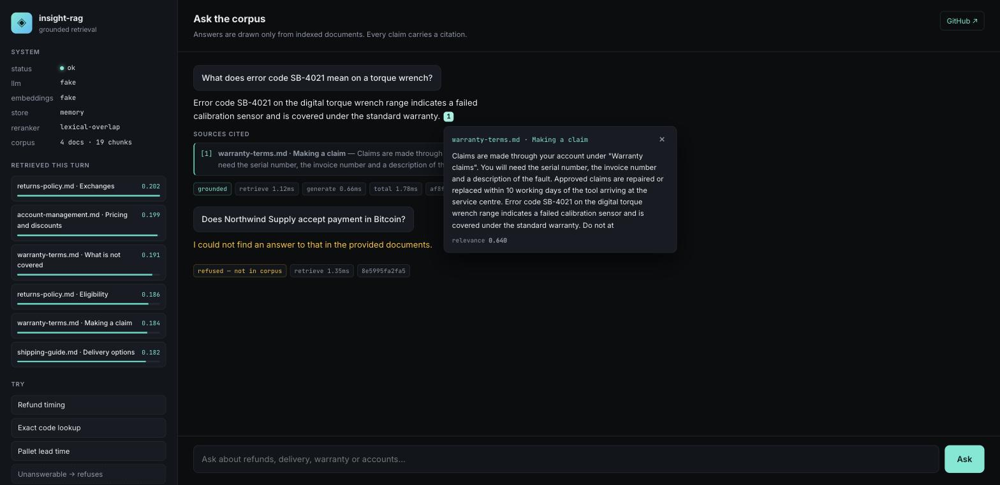

# insight-rag

**A production-shaped RAG service: hybrid retrieval, reranking, grounded citations, and a reproducible eval harness.**

Most RAG demos are a vector store, a `similarity_search(k=4)` call and a prompt. That works on
a slide and falls over on real documents — it misses exact identifiers, it cites passages the
model never read, it answers confidently when the corpus contains nothing relevant, and there
is no way to tell whether a change made retrieval better or worse.

`insight-rag` is the version I would actually deploy. It runs end to end with **no API key and
no network**, so you can clone it and see it work in about a minute.

```bash
git clone https://github.com/MABD001/insight-rag && cd insight-rag
make install && make run     # then open http://localhost:8000
```



*Left: what the retriever surfaced and how each passage scored. Centre: a grounded answer whose
citation chip opens the exact source text — and, below it, the same system refusing a question the
corpus cannot answer.*

---

## What makes it different from a tutorial

| Concern | Typical demo | `insight-rag` |
|---|---|---|
| Retrieval | Dense vectors only | **Hybrid** — dense + BM25 fused with reciprocal rank fusion |
| Precision | Top-k from the vector store | **Rerank pass** over the fused candidate set |
| Chunking | Fixed 1000-char split | **Structure-aware** — headings → paragraphs → sentences, with the heading trail embedded |
| Hallucination | Hope | **Grounding guardrail** — refuses below a tuned relevance threshold |
| Citations | Lists every retrieved chunk | Lists **only passages the answer actually cited**, with page and heading |
| Follow-ups | Breaks on "what about the second one?" | **Query rewriting** against conversation history |
| Cost | Unknown | Per-request **token, cost and per-stage latency** accounting |
| Quality | "Looks good to me" | **Eval harness** — faithfulness, context recall, citation precision, MRR |
| Re-indexing | Re-embeds everything | **Content-hash skip** — unchanged documents cost nothing |
| Tests | None | Deterministic suite, green offline with no API key |

---

## Architecture

```
                    ┌──────────────────────────────────────────────┐
  documents ──────► │  Ingest                                      │
  (pdf/md/html/txt) │  load → hash → structure-aware chunk → embed  │
                    └───────────────┬──────────────────────────────┘
                                    │
                       ┌────────────▼─────────────┐
                       │  Vector store (port)     │
                       │  memory  │  pgvector     │
                       └────────────┬─────────────┘
                                    │
  question ─► rewrite ─┬─► dense search  ─┐
                       │                  ├─► RRF fusion ─► rerank ─► guardrail
                       └─► BM25 search  ──┘                              │
                                                          grounded? ─────┤
                                              no ◄────────┘              │ yes
                                               │                         ▼
                                          refusal                 prompt assembly
                                                                         │
                                                                         ▼
                                                            LLM (stream) ─► citations
                                                            fake │ openai │ ollama
```

Three seams are deliberate ports with swappable adapters — `VectorStore`, `EmbeddingProvider`,
`ChatProvider`. That is what lets the same pipeline run against OpenAI + Postgres in production
and a deterministic fake + in-memory store in CI, with no branching in the pipeline code.

---

## Why it runs offline

`LLM_PROVIDER=fake` and `EMBEDDING_PROVIDER=fake` are the defaults, and they are not stubs that
return canned strings:

- The **fake embedder** is a hashed bag-of-words projection with L2 normalisation. The same text
  always produces the same unit vector, and texts sharing vocabulary land near each other — so
  cosine similarity remains a real signal.
- The **fake chat provider** answers extractively from the retrieved context and emits the same
  citation markers the real prompt asks for.

This means the retrieval tests measure *retrieval* rather than model variance, CI needs no
secrets, and a client evaluating the repo can run everything without spending a cent. Point it
at OpenAI or a local Ollama with two environment variables when you want real generation.

---

## Quick start

```bash
make install       # uv venv + dependencies
make ingest        # index sample_docs/
make run           # http://localhost:8000  (UI)  ·  /docs  (OpenAPI)
make test          # full suite, offline
make eval          # retrieval + answer quality scorecard
make lint          # ruff
```

With Docker (adds Postgres + pgvector):

```bash
docker compose up --build
```

Real models:

```bash
export LLM_PROVIDER=openai EMBEDDING_PROVIDER=openai OPENAI_API_KEY=sk-...
make run
```

Fully local with Ollama:

```bash
ollama pull llama3.1 && ollama pull nomic-embed-text
export LLM_PROVIDER=ollama EMBEDDING_PROVIDER=ollama EMBEDDING_DIMENSIONS=768
make run
```

---

## API

| Method | Path | Purpose |
|---|---|---|
| `POST` | `/api/chat` | Buffered answer with citations, tokens, cost, per-stage timings |
| `POST` | `/api/chat/stream` | Server-sent events: `meta` → `token`* → `done` |
| `GET` | `/api/search?q=` | **Retrieval without generation** — the endpoint for debugging relevance |
| `POST` | `/api/ingest/files` | Multipart upload |
| `POST` | `/api/ingest/paths` | Index a path or directory on the server |
| `DELETE` | `/api/documents/{id}` | Remove a document and its chunks |
| `GET` | `/api/health` | Active providers, store, reranker, corpus size |

```bash
curl -s localhost:8000/api/chat -H 'content-type: application/json' \
  -d '{"question":"How long do refunds take?"}' | jq
```

```json
{
  "request_id": "9f2c1a7b4e10",
  "answer": "Approved refunds are returned to the original payment method within 5 business days. [2]",
  "grounded": true,
  "citations": [
    { "marker": 2, "source": "returns-policy.md", "label": "returns-policy.md · Refunds",
      "score": 0.71, "snippet": "Approved refunds are returned to the original..." }
  ],
  "prompt_tokens": 412, "completion_tokens": 28, "cost_usd": 0.000079,
  "timings_ms": { "rewrite": 0.01, "retrieve": 8.4, "generate": 1.2, "total": 9.6 }
}
```

`/api/search` additionally returns each result's `dense_rank`, `sparse_rank`, `fused_score` and
`rerank_score`, which is how you find out *why* a passage surfaced.

---

## Evaluation

Shipping RAG without evaluation means every prompt tweak is a guess. `make eval` scores a golden
set in `eval/golden_set.yaml` and prints a scorecard:

- **Context recall** — did retrieval surface the passage that contains the answer?
- **MRR** — how highly was it ranked?
- **Citation precision** — did the answer cite the passages it actually used?
- **Faithfulness** — is every claim traceable to retrieved context?
- **Refusal accuracy** — does it decline on questions the corpus cannot answer?

The set deliberately includes unanswerable questions. A RAG system that scores well on answerable
questions and hallucinates on the rest is worse than no system at all.

Current run on the bundled corpus:

```
  retrieval & safety — provider independent
  Context recall       ████████████████████████ 100.00%
  MRR                  ███████████████████████· 95.56%
  Refusal accuracy     ████████████████████████ 100.00%
  Hallucination rate   ························ 0.00%

  answer quality — depends on llm=fake
  Answer match         ██████████████████████·· 93.33%
  Citation precision   ██████████████████······ 74.44%
  Overall pass rate    ███████████████████████· 94.44%
```

The scorecard is split deliberately. Retrieval and refusal metrics are provider-independent, so CI
gates on them. Answer-match and citation-precision depend on the generator, and with
`LLM_PROVIDER=fake` they are measuring a deliberately simple extractive stand-in — reported for
signal, but not gated, because gating them would be measuring the test double.

`make eval-compare` diffs against the previous run, so a config change shows up as a delta rather
than a vibe.

### What the guardrail is really doing

The first version of this used the obvious approach — refuse when the top retrieval score falls
below a threshold. Measured on the golden set, it hallucinated on **100%** of unanswerable
questions, because the two classes overlap outright:

```
answerable    best rerank score: 0.29 .. 0.66
unanswerable  best rerank score: 0.42 .. 0.47
```

No threshold separates those. The fix was to stop asking "is anything relevant?" and start asking
"are the *distinctive* terms of this question actually present in what we retrieved?" — weighting
each query term by corpus IDF and treating terms the corpus has never seen as maximum-weight
misses. On the same set:

```
answerable    weighted coverage: 0.09 .. 1.00
unanswerable  weighted coverage: 0.00, 0.00, 0.00
```

Hallucination rate went from 100% to 0%. The reasoning is written up in `app/rag/grounding.py`.

---

## Configuration

Every knob lives in `app/config.py` and is settable by environment variable or `.env`. The ones
that matter most:

| Variable | Default | Notes |
|---|---|---|
| `LLM_PROVIDER` / `EMBEDDING_PROVIDER` | `fake` | `fake` · `openai` · `ollama` |
| `VECTOR_STORE` | `memory` | `memory` · `pgvector` |
| `CHUNK_SIZE` / `CHUNK_OVERLAP` | `900` / `150` | Characters |
| `DENSE_TOP_K` / `SPARSE_TOP_K` | `20` / `20` | Candidates per retriever before fusion |
| `RRF_K` | `60` | Fusion constant; lower favours top-ranked items more sharply |
| `RERANK_TOP_N` | `6` | Passages that reach the prompt |
| `MIN_GROUNDING_SCORE` | `0.12` | Below this, the service refuses. Tune against your eval set |

---

## Project layout

```
app/
  config.py           all tunable behaviour, in one place
  providers/          fake · openai · ollama, behind one protocol
  ingest/             loaders (pdf/md/html/txt) + structure-aware chunker
  retrieval/          bm25 · rrf fusion · reranker · memory + pgvector stores
  rag/                prompts, pipeline, guardrail, citation resolution
  api/                routes and schemas
eval/                 golden set + scorer
tests/                deterministic, offline
ui/                   streaming chat UI with inline citations
```

---

## Notes on the tradeoffs

**Why BM25 by hand?** It is ~60 lines, it keeps tokenisation identical across the sparse and
dense paths, and it removes a dependency that breaks on new Python releases. For corpora beyond
~10^5 chunks I would move it into Postgres full-text search or OpenSearch — the `VectorStore`
port is where that swap belongs.

**Why Postgres instead of a dedicated vector DB?** Most teams already run it. One backup story,
one connection pool, transactional consistency between a document and its chunks, and metadata
filters in the same query as the vector search. A specialised store earns its keep at a scale
most projects never reach.

**Why a lexical reranker by default?** A cross-encoder is better and is used automatically when
`sentence-transformers` is installed. The default has to be dependency-free and deterministic so
CI stays honest and the container stays small — and because the grounding threshold needs a
calibrated score, both backends emit scores on the same 0–1 scale.

---

## License

MIT — see [LICENSE](LICENSE).

Built by [Muhammad Abdullah](https://github.com/MABD001) · [LinkedIn](https://www.linkedin.com/in/mabdse)
